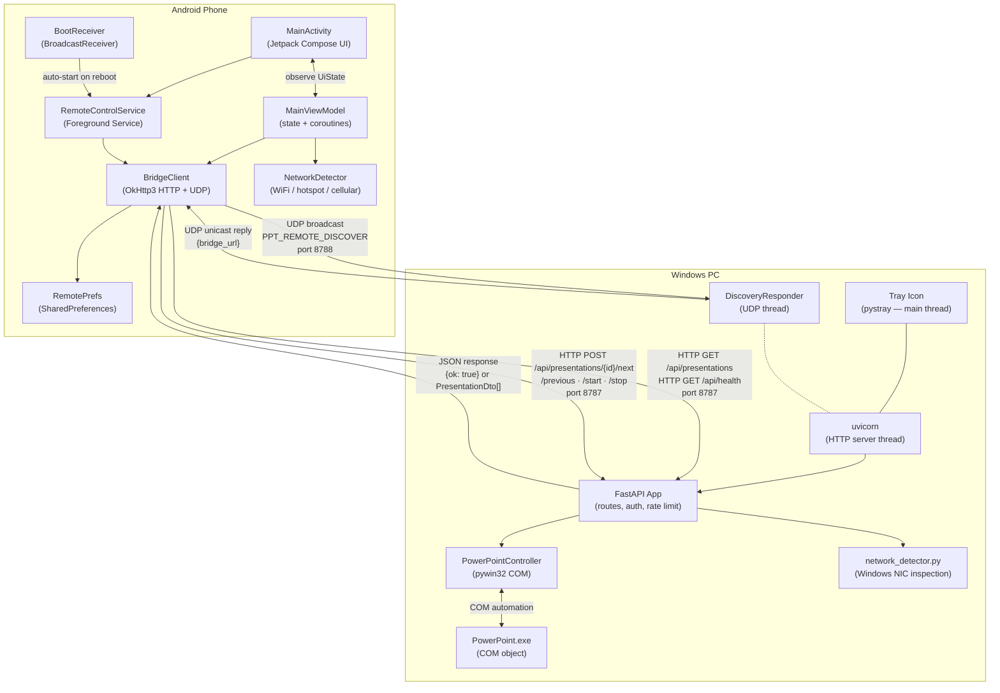

# PPT Remote — Architecture

This document describes the internal structure, communication flow, and design of the two-subsystem
PPT Remote project: the **Desktop Bridge** (Windows) and the **Android App**.

---

## Table of Contents

1. [Component Overview](#1-component-overview)
2. [Communication Flow Diagram](#2-communication-flow-diagram)
3. [Port Reference](#3-port-reference)
4. [Desktop Bridge Internals](#4-desktop-bridge-internals)
5. [Android App Internals](#5-android-app-internals)
6. [Data Flow: End-to-End Walkthrough](#6-data-flow-end-to-end-walkthrough)
7. [Background Execution](#7-background-execution)
8. [Environment Variables](#8-environment-variables)

---

## 1. Component Overview

PPT Remote is split into two independent but tightly coupled subsystems:

| Subsystem | Language / Stack | Runs On |
|---|---|---|
| `desktop_bridge/` | Python 3.10+, FastAPI, uvicorn, pywin32, pystray | Windows PC with PowerPoint |
| `mobile_remote_android/` | Kotlin, Jetpack Compose, OkHttp3 | Android phone (API 26+) |

**Desktop Bridge** is the server side. It wraps the PowerPoint COM automation API behind an HTTP
REST interface and announces itself on the local network via UDP so the Android app can find it
without the user typing an IP address.

**Android App** is the client side. It discovers the bridge, polls for presentation state, and
sends control commands when the user presses volume buttons or taps the on-screen controls. A
foreground service keeps it alive in the background so volume buttons continue to work when the
phone screen is off or the app is not in the foreground.

---

## 2. Communication Flow Diagram



> **Note:** The tray icon owns the Python main thread. `uvicorn` and `DiscoveryResponder` each run
> in their own daemon threads. All three are started together by `bridge_service.py`.

---

## 3. Port Reference

| Port | Protocol | Direction | Purpose |
|------|----------|-----------|---------|
| **8787** | TCP (HTTP) | Android → Desktop | REST API for all control commands and status polling |
| **8788** | UDP | Android → Desktop (broadcast), Desktop → Android (unicast) | Auto-discovery: phone broadcasts a token; desktop replies with its HTTP URL |

Both ports are configurable via environment variables — see [§8](#8-environment-variables).

Windows Firewall must allow **inbound** traffic on both ports from the local network. If
auto-discovery fails, only port 8787 needs to be reachable (the user can enter the IP manually).

---

## 4. Desktop Bridge Internals

### 4.1 Process Model

```
PptRemoteBridge.exe  (or  pythonw.exe run_background.py)
│
├── [Main Thread]       pystray tray icon — event loop, right-click menu
│
├── [Thread: uvicorn]   FastAPI HTTP server on 0.0.0.0:8787
│   ├── CORSMiddleware  (allow all origins)
│   ├── slowapi         (rate limiting, default 30 req/min on action routes)
│   ├── APIKeyHeader    (optional — only enforced when PPT_API_KEY is set)
│   └── Routes (see §4.3)
│
└── [Thread: Discovery] DiscoveryResponder UDP socket on 0.0.0.0:8788
```

### 4.2 Key Modules

| File | Responsibility |
|------|---------------|
| `main.py` | FastAPI application, all HTTP routes, CORS, auth, rate limiting, lifespan |
| `bridge_service.py` | Entry point: starts uvicorn thread, DiscoveryResponder thread, and tray icon |
| `powerpoint_controller.py` | All COM automation — list presentations, start/stop slideshow, next/previous, speaker notes |
| `network_detector.py` | Inspects Windows NIC configuration to classify the connection (WiFi / hotspot / cellular / ethernet) |
| `tray_icon.py` | `pystray` tray icon setup, menu actions, icon image generation |
| `run_background.py` | Headless entry point for `pythonw.exe` background mode (no tray icon) |

### 4.3 REST API Endpoints

| Method | Path | Rate Limited | Auth Required* | Description |
|--------|------|:---:|:---:|-------------|
| `GET` | `/api/health` | — | — | Bridge liveness + network type |
| `GET` | `/api/network/status` | — | ✓ | Detailed network classification + warning text |
| `GET` | `/api/presentations` | — | ✓ | List all open `.pptx` files with slide state |
| `POST` | `/api/presentations/{id}/start` | ✓ | ✓ | Start slideshow for a presentation |
| `POST` | `/api/presentations/{id}/stop` | ✓ | ✓ | Stop slideshow for a presentation |
| `POST` | `/api/presentations/{id}/next` | ✓ | ✓ | Advance one slide |
| `POST` | `/api/presentations/{id}/previous` | ✓ | ✓ | Go back one slide |
| `GET` | `/api/presentations/{id}/notes` | — | ✓ | Speaker notes for every slide |
| `GET` | `/api/presentations/{id}/current-notes` | — | ✓ | Speaker notes for the current slideshow slide |

\* Auth is only enforced when the `PPT_API_KEY` environment variable is set. When unset the bridge
runs in open mode (no key required).

`presentation_id` is the **URL-encoded full file path** of the `.pptx` (e.g.
`C%3A%5CUsers%5C...%5Ctalk.pptx`). The bridge URL-decodes and validates it before passing it to
the COM layer.

### 4.4 PowerPoint COM Automation

`PowerPointController` connects to the running `PowerPoint.Application` COM object via `pywin32`.
Key behaviours:

- **Auto-start slideshow**: If `next` or `previous` is called on a presentation that is not yet in
  slideshow mode, the controller starts the slideshow first and then advances the slide.
- **Error surface**: All COM errors are caught and re-raised as `PowerPointControllerError`, which
  the route handlers map to HTTP 400 responses.

### 4.5 UDP Discovery Protocol

1. Android sends a UDP broadcast to `255.255.255.255:8788` containing the ASCII token
   `PPT_REMOTE_DISCOVER`.
2. `DiscoveryResponder` receives the packet, determines the correct local interface IP that routes
   back to the phone (using a temporary UDP `connect()` trick), and replies with:
   ```json
   {"bridge_url": "http://192.168.1.x:8787"}
   ```
3. The Android app stores the URL in `RemotePrefs` and begins polling.

### 4.6 Logging

Rotating file log: `desktop_bridge/logs/bridge.log` — 5 MB per file, 3 file rotation, written by
the Python `logging` module. Background mode (`run_background.py`) sets the root log level to
`WARNING` to keep noise low.

---

## 5. Android App Internals

### 5.1 Class Map

```
com.antigravity.pptremote
│
├── MainActivity.kt          — Single-activity host; Compose UI; volume key capture (foreground)
├── MainViewModel.kt         — UiState holder; coroutine-based polling loop; runBridgeAction()
├── BridgeClient.kt          — All HTTP calls (OkHttp3) + UDP discovery broadcast
├── RemoteControlService.kt  — Foreground service; MediaSession + VolumeProvider (background keys)
│                              WakeLock; notification with Previous / Next / Start / Stop actions
├── BootReceiver.kt          — BroadcastReceiver for BOOT_COMPLETED / QUICKBOOT_POWERON;
│                              auto-starts RemoteControlService if a bridge URL is saved
├── NetworkDetector.kt       — Classifies current phone network (WiFi / hotspot / cellular)
├── RemotePrefs.kt           — SharedPreferences wrapper (bridge URL, last presentation id)
└── Models.kt                — Data classes: PresentationInfo, UiState, NetworkType, etc.
```

### 5.2 State Management

`MainViewModel` exposes a single `StateFlow<UiState>` consumed by `MainActivity`. The `UiState`
data class holds:

| Field | Type | Description |
|-------|------|-------------|
| `bridgeUrl` | `String` | Currently configured bridge URL |
| `presentations` | `List<PresentationInfo>` | Latest poll result |
| `selectedId` | `String?` | Presentation currently selected by the user |
| `isBusy` | `Boolean` | True while a command HTTP call is in flight |
| `networkWarning` | `String?` | Warning from phone-side network detection |
| `bridgeNetworkWarning` | `String?` | Warning returned by `/api/network/status` |
| `errorMessage` | `String?` | Last error to show to the user |

### 5.3 Polling Loop

`MainViewModel` launches a coroutine on `Dispatchers.IO` that calls `GET /api/presentations` every
**2 seconds**. The polling interval is adaptive:

| Network type | Poll interval |
|---|---|
| WiFi (standard) | 2 s |
| Hotspot (phone as AP) | 3 s |
| Cellular | 5 s |

If the bridge is unreachable the client applies **exponential backoff** before retrying.

### 5.4 Background Volume Button Capture

| Scenario | Mechanism |
|----------|-----------|
| App in foreground | `onKeyDown()` in `MainActivity` intercepts `KEYCODE_VOLUME_UP/DOWN` |
| App in background / screen locked | `RemoteControlService` registers a `MediaSession` with a custom `VolumeProvider`; Android routes volume key events to the active `MediaSession` |

`RemoteControlService` also holds a `PARTIAL_WAKE_LOCK` to prevent the CPU from sleeping while a
command is being dispatched.

### 5.5 Foreground Service & Notification

- **Channel**: `ppt_remote_channel` — importance HIGH.
- **Persistent notification actions**: Previous, Next, Start, Stop.
- **Dynamic text**: notification body updates to show the currently selected presentation name and
  the current slide number / total slides whenever the poll result changes.
- **Tap target**: tapping the notification opens `MainActivity`.

### 5.6 BootReceiver

Declared in `AndroidManifest.xml` with intent filters for:
- `android.intent.action.BOOT_COMPLETED`
- `android.intent.action.QUICKBOOT_POWERON` (HTC / OnePlus devices)

Guard: `BootReceiver` reads `RemotePrefs` and only starts `RemoteControlService` when a bridge URL
has been previously saved, avoiding a spurious service start on a fresh install.

---

## 6. Data Flow: End-to-End Walkthrough

```
Phase 1 — Discovery
───────────────────
Android App boots / user opens app
  └─▶ BridgeClient sends UDP broadcast to 255.255.255.255:8788
        payload: "PPT_REMOTE_DISCOVER"
  └─▶ DiscoveryResponder (desktop) receives packet
        replies with {"bridge_url": "http://192.168.x.x:8787"}
  └─▶ Android stores URL in RemotePrefs, updates UiState.bridgeUrl

Phase 2 — Connection & Initial Poll
────────────────────────────────────
MainViewModel polling coroutine starts
  └─▶ GET http://192.168.x.x:8787/api/presentations
  └─▶ FastAPI → PowerPointController.list_presentations()
        → COM: PowerPoint.Application.Presentations
  └─▶ Returns List<PresentationDto> (id, name, in_slideshow, current_slide, total_slides)
  └─▶ UiState.presentations updated → Compose recomposition
  └─▶ If exactly one presentation is in slideshow → auto-selected
  └─▶ GET /api/network/status → UiState.bridgeNetworkWarning set if hotspot

Phase 3 — Control Command (e.g. Volume Up → Next Slide)
────────────────────────────────────────────────────────
User presses Volume Up
  └─▶ onKeyDown() in MainActivity (foreground)
        OR VolumeProvider.onAdjustVolume() in RemoteControlService (background)
  └─▶ MainViewModel.runBridgeAction { bridgeClient.nextSlide(selectedId) }
        sets isBusy = true → LinearProgressIndicator shown in UI
  └─▶ POST /api/presentations/{encoded_id}/next
  └─▶ FastAPI: rate-limit check → auth check → _resolve_id() → PowerPointController.next_slide()
        → COM: SlideShowWindow.View.Next()
  └─▶ Returns {"ok": true}
  └─▶ isBusy = false → progress indicator hidden
  └─▶ Next poll cycle (≤2 s) refreshes current_slide in UiState

Phase 4 — Background (phone screen off)
────────────────────────────────────────
RemoteControlService keeps running as foreground service
  └─▶ MediaSession stays active → system routes volume key events here
  └─▶ VolumeProvider.onAdjustVolume() fires → same HTTP POST path as Phase 3
  └─▶ Notification text refreshed on next poll from service's own coroutine
```

---

## 7. Background Execution

### Desktop Side

| Mode | Entry point | Console? | How to launch |
|------|-------------|----------|---------------|
| Dev / debug | `start_bridge.ps1` → `python main.py` | Visible | `.\start_bridge.ps1` |
| Background (manual) | `start_background.ps1` → `pythonw.exe run_background.py` | Hidden | `.\start_background.ps1` |
| Background (auto-login) | Windows Task Scheduler task `PptRemoteBridge` | Hidden | `.\install_startup_task.ps1` |
| Standalone EXE | `dist/PptRemoteBridge.exe` | Hidden | `.\build_exe.ps1` then `.\install_startup_task.ps1 -Mode Exe` |

`start_background.ps1` writes the spawned process PID to `.bridge.pid`. `stop_background.ps1` uses
a three-layer kill strategy:

1. Read `.bridge.pid` and call `Stop-Process`.
2. If that fails, use `Get-WmiObject Win32_Process` (works without admin rights).
3. Final fallback: kill `PptRemoteBridge.exe` by name.

### Android Side

`RemoteControlService` is a `Service` declared with `android:foregroundServiceType="mediaPlayback"`.
Android OS gives it elevated priority as long as its foreground notification is visible. The
`BootReceiver` brings it back after a phone reboot without any user interaction.

---

## 8. Environment Variables

These variables are read by the desktop bridge at startup. They do not require a code change — set
them in your shell, in the Task Scheduler action, or in a `.env` file sourced by the launch script.

| Variable | Default | Required | Description |
|---|---|:---:|---|
| `PPT_BRIDGE_PORT` | `8787` | No | TCP port the FastAPI HTTP server listens on |
| `PPT_DISCOVERY_PORT` | `8788` | No | UDP port the DiscoveryResponder listens on |
| `PPT_API_KEY` | *(unset)* | No | When set, all API endpoints (except `/api/health`) require an `X-Api-Key: <value>` request header. When unset the bridge operates in open/unauthenticated mode. |

**Two-part change rule:** If you change a port default you must update it on **both** sides —
`desktop_bridge/main.py` and the Android `BridgeClient.kt` discovery logic — otherwise
auto-discovery and manual URL entry will disagree.

---

## 9. Repository Layout (Quick Reference)

```
Ppt_remote/
├── desktop_bridge/
│   ├── main.py                     # FastAPI app + all HTTP routes
│   ├── bridge_service.py           # Process entry point (tray + threads)
│   ├── powerpoint_controller.py    # COM automation wrapper
│   ├── network_detector.py         # Windows NIC / network type detection
│   ├── tray_icon.py                # pystray system tray icon
│   ├── run_background.py           # Headless entry point (pythonw.exe)
│   ├── requirements.txt            # Python dependencies
│   ├── start_bridge.ps1            # Dev launch (visible console)
│   ├── start_background.ps1        # Background launch (hidden)
│   ├── stop_background.ps1         # Kill background bridge (3-layer)
│   ├── install_startup_task.ps1    # Create Windows Task Scheduler entry
│   ├── remove_startup_task.ps1     # Remove Task Scheduler entry
│   ├── build_exe.ps1               # PyInstaller EXE build
│   ├── PptRemoteBridge.spec        # PyInstaller spec file
│   ├── logs/                       # Rotating log output (gitignored)
│   └── tests/
│       ├── conftest.py
│       ├── test_api.py             # FastAPI TestClient integration tests
│       └── test_network_detector.py
│
├── mobile_remote_android/
│   ├── app/src/main/java/com/antigravity/pptremote/
│   │   ├── MainActivity.kt
│   │   ├── MainViewModel.kt
│   │   ├── BridgeClient.kt
│   │   ├── RemoteControlService.kt
│   │   ├── BootReceiver.kt
│   │   ├── NetworkDetector.kt
│   │   ├── RemotePrefs.kt
│   │   └── Models.kt
│   └── app/src/test/java/com/antigravity/pptremote/
│       ├── BridgeClientTest.kt     # MockWebServer tests
│       ├── ModelsTest.kt
│       └── RemotePrefsTest.kt
│
├── .github/workflows/
│   └── android-prerelease.yml      # CI: build APK, publish GitHub pre-release
│
├── README.md
├── BACKGROUND_EXECUTION.md
├── ARCHITECTURE.md                 # ← this file
├── CONTRIBUTING.md
└── CHANGELOG.md
```
